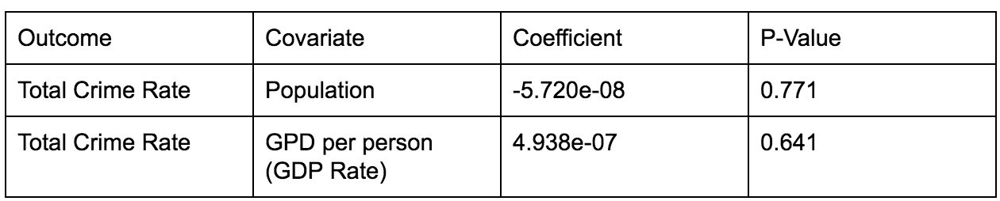
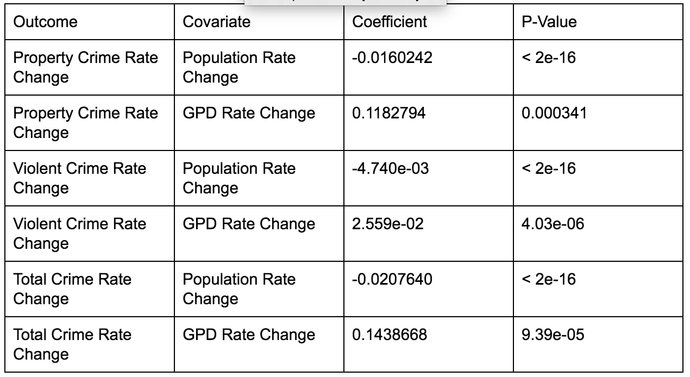

### Introduction
Currently, there are many different sites and organizations that collect data on cities or large metropolitan areas. The Federal Bureau of Investigation (FBI) collects crime data and population every year for individual cities within the United States and the Bureau of Economic Analysis (BEA) gathered an overall metropolitan area Gross Domestic Product (GDP) every year since 2010. There are a few different organizations or articles that have looked at a comparison between crime rates and the GDP of specific metropolitan areas, but our specific analysis considers population as another independent variable when comparing crime rate and GDP of metropolitan areas. Some of the related work we will discuss takes the change in economy after the 2008 financial crisis into account. One other research group took into account economic uncertainty, whereas we will focus more on the count data of a metropolitan area (population, GDP, crime rate). We want to look at the GDP and population relationship affected by crime to see if GDP per person and population of a metropolitan area have any impact on the crime rate within that metropolitan area.

Our analysis focuses on crime rate impact on city GDPs with population as another independent variable. The analysis is a unique contribution because rather than analyzing from the state level, we are choosing to focus on the metropolitan area level, adding an extra area of granularity. In terms of covariates, we are accounting for the population change between years along with the changes in GDP. This differentiates our work compared to previously produced work focusing on the variables by themselves. We are observing and comparing violent and property crime trends to metropolitan area GDP and population trends. 

Our analysis focuses on violent and property crime impact on city GDPs with population as another independent variable. The analysis is a unique contribution because rather than analyzing from the state level, we are choosing to focus on the city level, adding an extra area of granularity. In terms of covariates, we are accounting for the population change between years along with the changes in GDP and crime. We are observing and comparing violent and property crime trends to metropolitan area GDP and population trends. 

### Hypothesis
The research question we seek to answer is: How do GDP and population affect property, violent, and total crime rates within U.S. metropolitan areas?

We hypothesize that as population grows, crime rates would increase and that as GDP increases, the crime rate would decrease. We thought this because, generally speaking, one would think that with more people concentrated in an area the likelihood of crime would increase because there is less to control. Also, if the economy was doing well crime would potentially be decreasing since the economy would be in a state where people do not need to resort to committing crimes to survive. We also hypothesize that GDP decreases property crimes will increase, as populations will turn to crime to fix their economic troubles.

### Related Work

In the past, most research has been focused around states in the U.S. and countries around the world. In "Falling Together" [1], data from the U.S. Department of Justice from 2007-2010 was used to analyze the relationship between property crime rates and GDP per person in all 50 U.S. states. The results found that property crime rates and GDP both decreased during this time frame. Specifically after the recession, the general trend was as GDP decreased so did property crimes. The cause of the trend is unknown.

"The Puzzling Relationship Between Crime and the Economy" [2] delves into the clashing conclusions economists and criminologists draw from the relationship between crime and the economy. Criminologists believe that tough economic times increase the likelihood of a person committing a crime. They also believe that economic anxieties cause people to consume more mind-altering substances, leading to increased violence. Economists believe better economic conditions increase the likelihood of a person committing a crime. With technology becoming more visible and ingrained into people's lives, criminals are able to see what's possible to steal. Analysis on violent and property crimes from 1960-2012 suggests that there is no relationship between GDP and crime, and that crime is episodic.

In "Economic growth and crime: does uncertainty matter?" [3] 25 countries (including the U.S.) are analyzed with a macroeconomic uncertainty metric to observe whether there is a relationship between crime and GDP. The researchers found that if GDP uncertainty is negative, the crime uncertainty is positive, meaning that crime uncertainty negatively impacts GDP uncertainty. 

### Data Prep

The preparation of our data, specifically combining the crime and GDP datasets, was a very important and large aspect of conducting this research. The data given to us was very different in formatting and was therefore fairly difficult to combine. The FBI crime dataset had city names in one column rather than metropolitan areas (some cities combined), and in another column the state names were fully written out instead of having state abbreviations. All of the crime datasets were separated by year equalling six different datasets, whereas the GDP dataset had columns of GDP data separated by year equalling only one dataset that all had to be combined. 

To begin combining these two datasets, we joined all of the crime datasets together so that every year was accounted for in each city within the dataset along with the population of each city. From here, we decided that since the GDP dataset had less cities/metropolitan areas to account for, we would take all of the corresponding cities from the crime dataset and add the GDP for each of those cities to the crime dataset. We then removed any city within the crime dataset that did not include a GDP (was not included in the GDP dataset). New rows were added for the metropolitan areas that included more than one city (e.g. Seattle-Tacoma-Bellevue) and added up the population and crimes in each of the cities to get a total for the new row added. This is important because to keep the GDP accurate, we had to keep the cities combined as a metropolitan area, but we could account for the population and crimes by adding the counts together and doing analysis from the new totals. We also removed any metropolitan area from the GDP dataset that included multiple states and had to change any value in the dataset that was "NA" to "0" to be able to combine these datasets properly and include as many cities as we could in the analysis. Although "0" values may affect and weigh down the results, this was the best way for us to both keep as many cities as we could in the dataset and make the values calculable.

Our final dataset came out as a final CSV that included any city or metropolitan areas that were included in both the crime and GDP dataset. For each of these cities or metropolitan areas, we included the population of each metropolitan area, crime data for 2010-2015, and the GDP for 2010-2015. This came out to include 366 cities or metropolitan areas. We also added columns such as "crime per person" and "gdp per person" in each metropolitan area in order to support our analysis.

One thing to note is that to reproduce this research you will have to use the CSV we created. Alternatively, any other researcher could find other data sources for GDP and crime for the years 2010 to 2015 and create their own new dataset. You must also change any "NA" values in the dataset to "0" to combine the data. 

Some definitions to note are 
'violent crimes' is defined by four offenses: murder and nonnegligent manslaughter, rape, robbery, and aggravated assault. 
'property crimes' is defined by four offenses: burglary, larceny theft, motor vehicle theft, and arson.
Crime rate, as defined by this research, is the total number of crimes in a metropolitan area divided by the population of that metropolitan area to become crime per person. 

### Methods and Analysis 
In order to research this dataset we first chose to take a look at the crime rate data via Poisson regression using population and GDP per person as outcomes. Our crime rate data was measured by dividing the total counts of those crimes by metropolitan area and dividing them by that area's population. We analyzed crime using three different outcomes for our regressions: violent crime, property crime, and total crime (violent and property combined.) For covariates, we used GDP per person and population by metropolitan area.
We reorganized the structure of the data from wide format to long format - placing the variables for each year in the same column instead of separate columns for each year. This allowed us to try to predict outcomes for all years in our dataset instead of one year at a time as the data was originally structured.
Violent crime rates were usually lower than property crime rates. We ran into issues where some cities had not fully reported crimes, putting null values in our dataset. These occurrences were low enough that we decided to set them to zero so we would not have to throw out data for entire cities.
After seeing the non-significant results from our Poisson regression for total crime we decided to take a further look at the data. While total occurrences of our variables might not show much correlation, there was a possibility that changes in our hypothesized crime predictors could significantly relate to changes in our crime outcomes. So we decided to switch gears and calculate the rate changes in both our covariates and our outcomes to see if there was a correlation. We decided that a linear regression was more appropriate for analyzing this data as we were no longer using count data. 
To do this we simply took the difference of crime rates between each consecutive year for property, violent, and total crime rates. We used the difference in GDP per person for consecutive years and the rate change in population for consecutive years as our covariates. Similarly to our first analysis, we structured our data in long format with columns that included each consecutive years pair for each variable.

### Results
For our Poisson regressions, we found no significant correlations between crime rate and our covariates of population and GDP per person. This was the case for all outcomes of property, violent, and total crime.

After viewing the extremely low confidence intervals of our regression for total crime we decided to reframe our data and use a linear regression on the crime rate change instead of just the crime rate.
For our linear regression we found significant correlations between crime rate changes of all types and our covariates of changes in population (negatively) and changes in GDP per person (positively). 

### Discussion
We initially hypothesized that there would be a correlation between counts of GDP per person, population and crime per person. However our analysis found that this was not the case. It is likely that there are far too many factors involved in predicting crime rates, and that population and GDP alone, cannot confidently do the job. Possible confounds could be education, unemployment, wealth disparity, unreported population or crime, and likely many more.

The results of our linear regression on rate changes in our variables were also quite surprising. We hypothesized that higher population and lower GDP would result in higher crime rates. But our regressions shows that as population decreases, crime rates of all kinds increase, and as GDP increases, crime rates of all kind increase. Although our hypothesis referred to total variable counts, we believe it extends to rate changes in our variables similarly. However rate changes showed the opposite of what we hypothesized. Additionally we hypothesized that low GDP would correlate to high property crime at a lower coefficient than to violent crime, as more people would be committing crimes to acquire more money in a poor economy. However, we found in our linear regression that when GDP increases, violent crimes increase at a greater rate than property crimes. So GDP seems to affect violent crimes more than property crimes, which is not what we expected.

Because our results are off from our original hypothesis, we are naturally skeptical about them. As stated earlier, it appears predicting crime rates is not as cut and dry as looking at GDP and population. It is likely that crime rate changes are also influenced by many other outside factors. There are numerous possible next steps to take with these results. Future work could greatly improve, reinforce, or reinterpret our results and better explain how crime rates can be predicted. 

### Future Work

While we looked at GDP and crime rate, to extend the work we have done here, other researchers can also compare GDP and crime rate per city with other independent variables other than population that may also affect the correlation. One example is other related work uses economic uncertainty as an independent variable and there are other variables that could possibly show a correlation between the GDP and crime rate of a city such as education, population density, health metrics, and many more. 

One other aspect to consider is the particular datasets used and how the data is measured. Since we are sorting by metropolitan area, crime rate to us is defined as total number of crimes divided by the population of each city or metropolitan area within the dataset. The GDP dataset that we chose to use was in a very unfortunate format when trying to combine it with the crime dataset, so we would suggest that in future work, an alternative GDP dataset defined by U.S. city rather than by metropolitan area be used.

### References

[1] The Economist Online. "Falling Together." The Economist. The Economist Newspaper, 26 Sept. 2011. Web. 05 Mar. 2017. 

[2] Roman, John. "The Puzzling Relationship Between Crime and the Economy." CityLab. The Atlantic, 23 Sept. 2013. Web. 05 Mar. 2017.

[3] Goulas, Eleftherios, and Athina Zervoyianni. "Economic Growth and Crime: Does Uncertainty Matter?" Applied Economics Letters 20.5 (2013): 420-27. Web.

